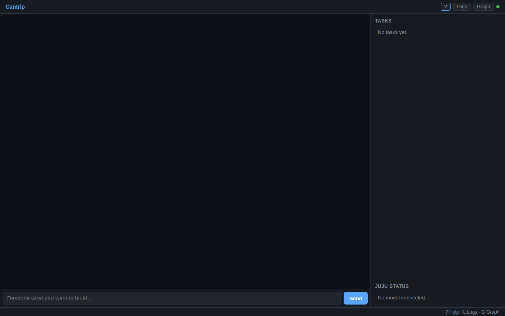
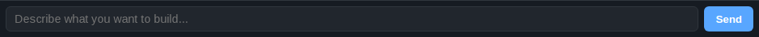
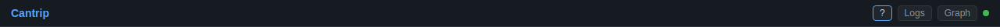

# Cantrip Web UI Accessibility Audit

*Captured 2026-04-18 against `src/cantrip/web/` using [rodney](../../rodney)
for Chromium DevTools automation and [showboat](https://github.com/canonical/showboat)
to record a reproducible audit trail.  The original executable document is
preserved under the working directory `/tmp/cantrip-audit/audit.md`; this is
the design-folder copy, with the evidence condensed and the findings kept
verbatim.*

Scope: the static landing page (chat input, task list, Juju status panel) and
the three modal overlays (help, logs, integration graph).  The audit ran
against the UI as rendered on an empty working directory with no dev model
attached, so dynamic content (chat messages, task cards, Juju app cards) was
exercised only by inspecting the DOM wiring, not by driving an agent turn.



## How it was run

```bash
# Terminal 1 — start the UI
GEMINI_API_KEY=dummy uv run cantrip --web --web-port 8471 /tmp/scratch

# Terminal 2 — run the audit
cd /tmp/cantrip-audit
rodney start --local
rodney open http://127.0.0.1:8471/
rodney waitload

uvx showboat init audit.md "Cantrip Web UI Accessibility Audit"
# ... then successive `showboat exec ... bash "rodney js '...' "` blocks
```

The audit.md produced by showboat re-runs under `showboat verify` with exit 0,
so the evidence below is mechanically reproducible.

## 1. Page fundamentals

`lang="en"`, `charset=utf-8`, viewport meta correct.  Heading outline
and landmark inventory:

```
headings  : H1 Cantrip · H2 Tasks · H2 Juju Status · H2 Keyboard Shortcuts
            · H2 Juju Logs · H2 Integration Graph
landmarks : header · main · section#chat-panel · section#right-panels · footer
```

`rodney ax-tree --depth 4` rendered:

```
[RootWebArea] "Cantrip"
  [banner]
    [heading] "Cantrip" (level=1)
    [button]  "?"
    [button]  "Logs"
    [button]  "Graph"
    [generic] "Connected"
  [main]
    [generic]  (chat-panel — no landmark role)
      [textbox] "Describe what you want to build…"
      [button]  "Send"
    [generic]  (right-panels — no landmark role)
      [heading] "TASKS" (level=2)
      [heading] "JUJU STATUS" (level=2)
  [contentinfo]
    [StaticText] "? Help · L Logs · G Graph"
```

Both `<section>` elements fall back to `[generic]` in the a11y tree — the
browser only exposes them as landmarks when they carry an accessible name.

## 2. Interactive controls

Every interactive element on the page, and what `rodney ax-node` reports for
it:

| Element            | Accessible name                     | Notes                                              |
|--------------------|-------------------------------------|----------------------------------------------------|
| `#btn-help`        | `?` (description: `Help (?)`)       | Name is the glyph; `type` defaults to `submit`     |
| `#btn-logs`        | `Logs`                              | `type` defaults to `submit`                        |
| `#btn-graph`       | `Graph`                             | `type` defaults to `submit`                        |
| `#chat-input`      | `Describe what you want to build…`  | Name comes from placeholder — no `<label>`         |
| `#chat-form button`| `Send`                              | No `type` attribute, no `aria-label`               |
| `#connection-status`| `Connected` (from `title`)         | `role="generic"`, empty text content               |

None of the overlay trigger buttons carry `aria-expanded` or `aria-controls`.
None of the overlays carry `role="dialog"`, `aria-modal`, or `aria-labelledby`.

## 3. Overlays, live regions, keyboard behaviour

With `#help-overlay` open:

```json
{
  "help_overlay_hidden": false,
  "active_element_id": "btn-help",
  "focus_inside_overlay": false,
  "main_inert": false,
  "main_aria_hidden": null,
  "tabbable_under_overlay": 5
}
```

Escape *does* close every overlay (there is a global handler in
`cantrip.js:386`).  Click-outside-to-close works.  No focus management happens
in either direction.

Live-region audit:

```json
{
  "chat_messages_role": null, "chat_messages_aria_live": null,
  "thinking_role": null,      "thinking_aria_live": null,
  "status_dot_role": null,    "status_dot_aria_label": null,
  "status_label_role": null,  "status_label_aria_live": null
}
```

Contrast (white-on-blue being the important one):

| Element            | Contrast | Font        | AA 4.5:1 |
|--------------------|---------:|-------------|:--------:|
| body text          |    12.26 | 14px/400    |    ✓    |
| `h1` / charm name  |     6.85 | 14px/600    |    ✓    |
| `.header-btn`      |     9.86 | 12px/400    |    ✓    |
| `#chat-input`      |     9.86 | 14px/400    |    ✓    |
| **`#chat-form button` (Send)** | **2.53** | 13.3px/600 | ✗ |
| `.footer-hint`     |     5.62 | 12px/400    |    ✓    |
| `.task-empty` / `.juju-empty` | 5.62 | 13px/400 | ✓  |

Focus indicators, captured by screenshotting after programmatic `.focus()`:





The Send button shows zero visual change when focused.  Header buttons rely on
the browser's UA focus ring (computed `outline-style: none 0px`, but Chromium
still paints `outline-style: auto` — barely visible here because the button
border is already blue).

## 4. Findings

Severity key: **High** — blocks a category of users or fails WCAG 2.1 AA.
**Medium** — degrades experience but has workarounds.  **Low** — polish.

### High

1. **Send button has no visible focus indicator** (WCAG 2.4.7 AA).
   `#chat-form button` has no `:focus`/`:focus-visible` rule and sits on an
   accent-blue background, so even the UA ring is effectively invisible.
   Add a high-contrast ring:
   `#chat-form button:focus-visible { outline: 2px solid #fff; outline-offset: 2px; }`.

2. **Send button text contrast 2.53:1** (WCAG 1.4.3 AA requires 4.5:1).
   `#fff` on `var(--accent)=#58a6ff`.  Either darken the accent used for
   button backgrounds (e.g. `#1f6feb`) or switch text to `#0d1117` — black
   on the current blue gives ~6.7:1.

3. **Chat input has no programmatic label** (WCAG 3.3.2, 4.1.2).
   `#chat-input` relies solely on `placeholder`.  Chrome currently uses the
   placeholder as accessible name, but placeholders disappear on input and
   are inconsistent across assistive tech.  Add either a visible label
   (`<label for="chat-input">What to build</label>`) or
   `aria-label="Describe what you want to build"`.

4. **No live regions for dynamic content** (WCAG 4.1.3).  Screen-reader
   users never hear:
   - new assistant messages — `#chat-messages` needs `role="log"`
     `aria-live="polite"` `aria-relevant="additions"`;
   - the "Thinking…" indicator — `#thinking-indicator` needs
     `role="status"` `aria-live="polite"`, and should stay in the DOM with
     `aria-hidden` toggled rather than being `display:none`d via `.hidden`;
   - connection state — `#connection-status` needs a real label and
     `role="status"`, or a sibling sr-only live region.

5. **Overlays are not dialogs and do not manage focus**
   (WCAG 2.4.3, 2.1.2, 4.1.2).  `#help-overlay`, `#logs-overlay`,
   `#graph-overlay` have no `role="dialog"`, no `aria-modal="true"`, no
   `aria-labelledby`.  On open, focus stays on the trigger button; Tab leaks
   into the backdrop (`main` is not `inert`).  On close, focus is not
   restored.  Remediation:
   - Mark each overlay `role="dialog" aria-modal="true" aria-labelledby="<heading-id>"`.
   - On open: capture `document.activeElement`, focus the first focusable
     child (or the heading with `tabindex="-1"`), and set `inert` on
     `<header>` / `<main>` / `<footer>`.
   - On close: clear `inert` and `.focus()` the stored opener.
   - Add a minimal Tab/Shift-Tab trap inside the overlay.

### Medium

6. **Header buttons default to `type="submit"`**.  `#btn-help`, `#btn-logs`,
   `#btn-graph` have no `type` attribute.  Behaviour is benign today because
   they sit outside any form, but a future refactor that nests them in a
   form would silently submit it.  Add `type="button"`.

7. **Help button accessible name is "?"**.  `rodney ax-node #btn-help` →
   `name: ?`.  Screen readers announce "question mark, button".  Add
   `aria-label="Help"`; keep the glyph as the visible label.  The same
   principle applies to the connection dot.

8. **Connection status dot is label-only via `title`** (WCAG 1.1.1 / 4.1.2).
   `<span id="connection-status" title="Disconnected">` has no text content
   or `aria-label`.  `title` is mouse-only on touch devices and
   unevenly announced.  Update `_setStatus` in `cantrip.js` to set both
   `title` and `aria-label`, and add `role="status"`.

9. **Overlay trigger buttons lack `aria-expanded` / `aria-controls`**.
   Disclosure buttons should reflect the state of what they control.
   Update `toggleHelp/Logs/Graph` to flip `aria-expanded` on the
   corresponding `#btn-*`.

10. **Tab-target leak into hidden overlays**.  Overlays use `display:none`
    via `.hidden` (good — removes them from the tab order), but when an
    overlay is open the backdrop remains reachable by Tab.  Covered by
    the remediation for finding 5.

### Low

11. **Shortcuts are `<table>`**.  The help overlay uses `<table><tr><td>`
    without `<caption>` / `<th>` / `<kbd>`.  Semantically it's a list of
    pairs — use `<dl>` or at minimum wrap keys in `<kbd>` and add a caption.

12. **Global single-key shortcuts** (`L`, `G`, `R`, `?`).  These fire on any
    keydown outside an input.  WCAG 2.1.4 (Character Key Shortcuts) calls
    for them to be remappable or to require a modifier.  Consider gating
    behind `Alt+L` / `Alt+G` or offering a disable toggle; the current
    `INPUT`/`TEXTAREA` guard is correct.

13. **Muted text at 5.62:1** on `.footer-hint`, `.task-empty`,
    `.juju-empty` passes AA but fails AAA (7:1).  Fine for now, worth
    noting if AAA is ever a target.

14. **`<section>` elements without accessible names** appear as
    `[generic]` in the a11y tree.  Add `aria-labelledby` pointing at each
    section's `<h2>` so screen-reader users can navigate by region.

## Remediation is tracked in ROADMAP Phase 60
