# Add COS to an existing charm

This flow covers the four-step decision tree for wiring the
Canonical Observability Stack into a charm: metrics first, then
logs, then dashboards, then tracing.  Every step is independent —
the agent can stop at any terminal node if the workload doesn't
need that capability.

```mermaid
flowchart TD
    survey[Inspect existing charm]
    has_metrics{Workload exposes metrics?}
    add_metrics[Add prometheus_scrape]
    metrics_endpoint[Document metrics endpoint]
    has_logs{Workload writes logs?}
    add_logs[Add loki_push_api]
    has_dashboards{Existing Grafana dashboards?}
    add_dashboards[Add grafana_dashboard]
    new_dashboards[Author starter dashboards]
    has_tracing{Want distributed tracing?}
    add_tracing[Add ops-tracing + Tempo relation]
    review[Review charmcraft.yaml + relation list]
    test[Run make check]
    fail(Refuse — needs author input)
    done(Done — COS wired)

    survey --> has_metrics
    has_metrics -->|yes| add_metrics
    has_metrics -->|no| metrics_endpoint
    metrics_endpoint --> fail
    add_metrics --> has_logs
    has_logs -->|yes| add_logs
    has_logs -->|no| has_dashboards
    add_logs --> has_dashboards
    has_dashboards -->|yes| add_dashboards
    has_dashboards -->|no| new_dashboards
    add_dashboards --> has_tracing
    new_dashboards --> has_tracing
    has_tracing -->|yes| add_tracing
    has_tracing -->|no| review
    add_tracing --> review
    review --> test
    test --> done

    %% survey: Read charmcraft.yaml and src/charm.py to understand existing relations and Pebble services.
    %% has_metrics: Check the workload documentation. Pick "yes" if the workload exposes a Prometheus-compatible /metrics (or similar) endpoint; "no" if it doesn't expose any metrics today.
    %% add_metrics: Add the prometheus_scrape provider charm library and a metrics-endpoint relation. Use the PyPI version, not charmcraft fetch-libs.
    %% metrics_endpoint: Document the absence of a metrics endpoint. The charm cannot expose Prometheus metrics until the workload does. Stop here and ask the user.
    %% has_logs: Check whether the workload writes to stdout/stderr (Pebble captures these automatically) or to a log file. Pick "yes" if either; "no" only if the workload genuinely emits no logs.
    %% add_logs: Add the loki_push_api consumer charm library and a logging relation. Wire it through Pebble's log-targets so workload logs reach Loki.
    %% has_dashboards: Check whether upstream maintainers ship Grafana dashboards (mixins, JSON files in the workload repo). Pick "yes" if upstream dashboards exist; "no" if you need to author them from scratch.
    %% add_dashboards: Add the grafana_dashboard provider charm library. Vendor upstream dashboards into src/grafana_dashboards/ and wire them through the relation.
    %% new_dashboards: Author starter dashboards covering request rate, error rate, latency, and saturation panels using the workload's documented SLOs where they exist.
    %% has_tracing: Decide whether the charm code (or the workload, via OpenTelemetry) should emit traces. Pick "yes" if either is in scope; "no" to stop after metrics and logs.
    %% add_tracing: Add the tracing consumer charm library and the ops-tracing PyPI package. Every Operator Framework hook will emit a span automatically.
    %% review: Re-read charmcraft.yaml. Confirm the new relations are declared and the charm-libs section lists every PyPI library you added.
    %% test: Run make check. Resolve any unit-test failures from the new relations before declaring the flow complete.
    %% fail: Refuse — the workload needs to expose metrics for COS to be useful. Ask the user whether to add a metrics endpoint to the workload itself or skip metrics.
    %% done: COS wiring is complete. The charm has prometheus_scrape, optionally loki_push_api, optionally grafana_dashboard, and optionally tracing relations.
```

