# Migrate a reactive charm to the Operator Framework

A reactive-to-ops migration touches four moving parts: layers and
hooks become observed events, actions stay on as event handlers,
relations either keep their interface names or are reshaped, and
service management moves from layer scripts to a Pebble plan.
This flow makes those choices explicit so the migration doesn't
silently change the charm's external contract.

For the parameterised execution side of the same migration, see
the ``charm-reactive-to-ops`` recipe — flows describe the
*decision tree*, recipes describe the *parameterised execution*.

```mermaid
flowchart TD
    inventory[Inventory the reactive charm]
    ootd{Out-of-tree dependency without an ops equivalent?}
    has_actions{Charm declares actions?}
    keep_actions{Preserve every action?}
    port_actions[Port actions one-to-one]
    drop_actions[Drop unused actions and document]
    relations{Preserve relation interfaces?}
    keep_relations[Keep interface names]
    rename_relations[Rename interfaces and bump major]
    pebble{Workload manages services?}
    port_pebble[Translate layer to Pebble plan]
    no_services[Skip Pebble — no long-running service]
    scaffold[Generate ops.CharmBase scaffold]
    write_tests[Add Scenario + Jubilant tests]
    cleanup[Remove charms.reactive imports]
    test[Run make check]
    abort(Refuse — needs author input)
    done(Done — migration complete)

    inventory --> ootd
    ootd -->|yes| abort
    ootd -->|no| has_actions
    has_actions -->|yes| keep_actions
    has_actions -->|no| relations
    keep_actions -->|yes| port_actions
    keep_actions -->|no| drop_actions
    port_actions --> relations
    drop_actions --> relations
    relations -->|yes| keep_relations
    relations -->|no| rename_relations
    keep_relations --> pebble
    rename_relations --> pebble
    pebble -->|yes| port_pebble
    pebble -->|no| no_services
    port_pebble --> scaffold
    no_services --> scaffold
    scaffold --> write_tests
    write_tests --> cleanup
    cleanup --> test
    test --> done

    %% inventory: List every layer.yaml, layer-options.yaml, @when/@hook/@when_not decorator, action handler, relation interface, and any service-management code in hooks/.
    %% ootd: Check whether any reactive layer pulls in an out-of-tree dependency that has no ops-framework equivalent (custom Python C extensions, charmhelpers patterns with no PyPI replacement, hookenv calls with no clean port). Pick "yes" to abort and ask the user; "no" to proceed.
    %% has_actions: Check actions.yaml. Pick "yes" if any actions are declared; "no" if the file is empty or absent.
    %% keep_actions: Decide whether every action declared in actions.yaml should survive the migration. Pick "yes" to preserve all of them; "no" to drop unused actions and surface a deprecation note.
    %% port_actions: Add an _on_<action>_action handler in the new ops.CharmBase subclass for every action in actions.yaml. Match the parameter shapes exactly.
    %% drop_actions: Remove unused or duplicated actions from actions.yaml. Document the removal in CHANGELOG.md so operators upgrading from the reactive charm see why their habit broke.
    %% relations: Decide whether already-deployed bundles must continue relating without intervention. Pick "yes" to preserve the interface names from metadata.yaml; "no" if the migration is large enough to justify a breaking change.
    %% keep_relations: Re-declare every relation in charmcraft.yaml using the existing interface names. Already-deployed bundles continue working unchanged.
    %% rename_relations: Reshape relation interfaces freely. Bump the charm's major version in charmcraft.yaml and write a migration note in CHANGELOG.md.
    %% pebble: Check whether the reactive charm's layer manages a long-running workload service. Pick "yes" if a service exists; "no" if the charm is purely an action / relation broker.
    %% port_pebble: Translate the reactive layer's service-management code into a Pebble plan via ops.pebble. Restart semantics, file ownership, and environment variables must match the reactive charm exactly.
    %% no_services: Skip Pebble plan generation. The charm has no long-running service to manage.
    %% scaffold: Generate src/charm.py with an ops.CharmBase subclass. Observe every framework event a reactive @when watched and wire the action handlers and Pebble plan.
    %% write_tests: Add Scenario unit tests in tests/unit/ (use ops.testing, not Harness) covering every observed event and action. Add Jubilant integration tests in tests/integration/ covering the deploy + relation flow.
    %% cleanup: Remove charms.reactive, hookenv, and any layer-* directories. charmcraft.yaml must declare a non-reactive build path.
    %% test: Run make check. Resolve any unit-test failures from the migration before declaring the flow complete.
    %% abort: Refuse — the reactive charm depends on out-of-tree behaviour with no ops-framework equivalent. Ask the user how to proceed before continuing.
    %% done: Migration complete. The charm is ops-only, tests pass, and the relation interfaces are documented.
```

