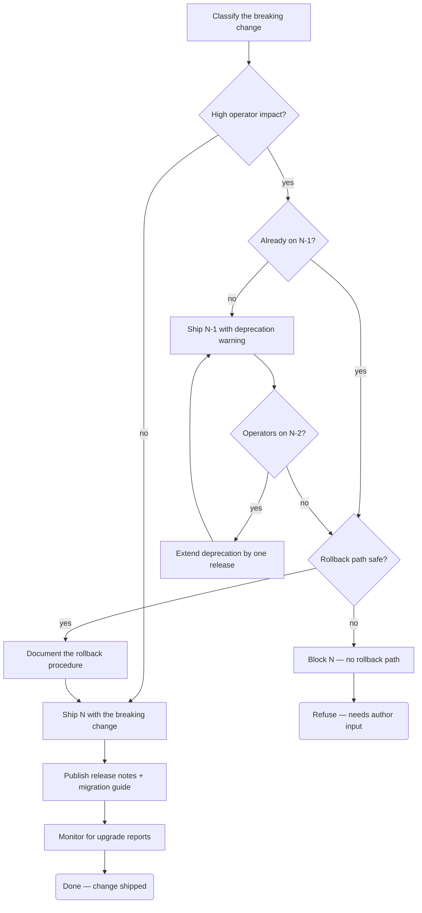

# Charm upgrade ladder

When a charm needs to break a contract — rename a relation, drop
a config option, change a default — the right answer is rarely a
single release.  The ladder is three releases (or more) with
explicit deprecation periods so operators upgrading from N-2 land
on documented warnings rather than silent breakage.

This flow walks the decision tree for a single breaking change.
Run it once per change; multiple breaking changes in the same
release are independent decisions on the same ladder.

